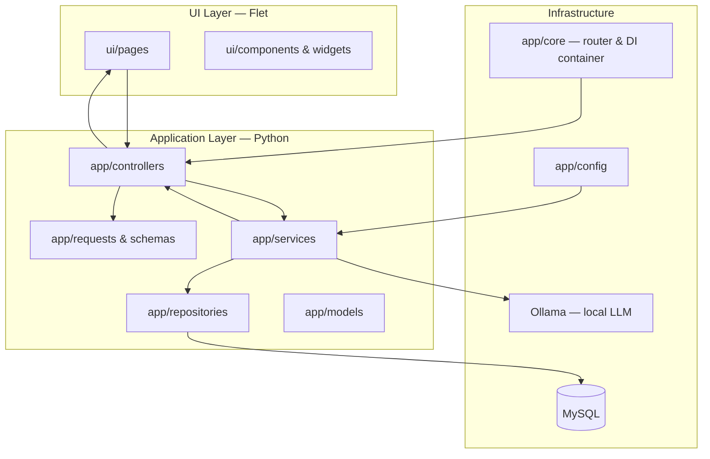

# StackWise AI — Demo Presentation Architecture Guide

Use this document when you need to **explain the project structure and architecture** during a demo, defense, or capstone presentation. It is written as a **speaker script**, not as internal developer documentation.

For deeper technical detail, see:

- [ARCHITECTURE_FLOW_AND_FOLDER_GUIDE.md](./ARCHITECTURE_FLOW_AND_FOLDER_GUIDE.md) — folder-by-folder flow
- [STACKWISE_BACKEND_DEFENSE_QA.md](./STACKWISE_BACKEND_DEFENSE_QA.md) — defense Q&A and code locations

---

## 1. One-sentence pitch (open with this)

> **StackWise AI is a decision-support app that recommends a programming language, framework, and SDLC model from project requirements — built with a layered Python backend, a Flet desktop UI, MySQL persistence, and optional local AI via Ollama.**

Say it once, then show the folder tree.

---

## 2. The story to tell (30 seconds)

Use this narrative — it matches how the code is actually organized:

1. **User interacts** with a Flet page (`ui/pages/`).
2. A **controller** receives the action and validates input (`app/controllers/`).
3. A **service** runs business logic — scoring, AI, auth (`app/services/`).
4. A **repository** talks to MySQL when data must be saved (`app/repositories/`).
5. Results flow **back up** to the UI.

**Key line for the audience:**

> “Each layer has one job. UI shows things, controllers coordinate, services think, repositories store.”

---

## 3. Architecture diagram (put on a slide)

---

## 4. Folder walkthrough (match your IDE sidebar)

Walk top to bottom in the file explorer. For each folder, use the **one-liner** below.

| Folder / file | What to say (one-liner) | Point to if asked |
|---|---|---|
| **`app/`** | “All backend logic lives here — separated by responsibility.” | — |
| **`app/config/`** | “Environment and settings: app, database, AI.” | `app_config.py`, `database_config.py`, `ai_config.py` |
| **`app/controllers/`** | “Glue between UI and backend — handles clicks, navigation, session.” | `recommendation_controller.py` |
| **`app/core/`** | “App wiring: routes, dependency injection, session.” | `router.py`, `container.py` |
| **`app/data/`** | “Static or curated data used by features (e.g. learning topics).” | `learning_hub_topics.py` |
| **`app/helpers/`** | “Small adapters and compatibility helpers.” | `recommendation_engine_compat.py` |
| **`app/models/`** | “Data shapes — what a user or recommendation looks like in memory.” | `recommendation.py`, `user.py` |
| **`app/repositories/`** | “Database access only — SQL, no business rules.” | `recommendation_repository.py` |
| **`app/requests/`** | “Validated input from forms — login, register, recommendation.” | `recommendation_request.py` |
| **`app/schemas/`** | “Structured validation / typing for service inputs.” | `research_support_schema.py` |
| **`app/services/`** | “Where decisions happen — scoring, AI, auth, analytics.” | `recommendation_service.py` |
| **`app/utils/`** | “Shared utilities: logging, constants, validators.” | `logger.py` |
| **`assets/`** | “Images, logos, static files for the UI.” | `assets/logos/` |
| **`database/`** | “Schema setup, migrations, seed data.” | `migrations/initial_migration.py` |
| **`docs/`** | “Project documentation for architecture and defense.” | This file |
| **`tests/`** | “Automated checks for engine and DB safety.” | `tests/` |
| **`ui/`** | “Everything the user sees — pages, layouts, theme, animations.” | `ui/pages/recommendation_page.py` |
| **`main.py`** | “Thin entrypoint — boots config, container, router, Flet.” | `main.py` |

---

## 5. Layer rules (show this if panelists ask “why not put everything in one file?”)

| Layer | Does | Must NOT do |
|---|---|---|
| **UI** (`ui/`) | Render, collect input, show results | Business logic, SQL |
| **Controllers** | Coordinate UI ↔ services, navigation, session | Scoring rules, direct SQL |
| **Services** | Business logic, orchestration, AI calls | UI widgets, raw SQL |
| **Repositories** | Persist and load data | Scoring, UI |
| **Models** | Represent data | Logic, queries |

**Sound bite:**

> “If we change the database, we only touch repositories. If we change how scoring works, we only touch services. The UI stays stable.”

---

## 6. Boot sequence (good for “how does the app start?”)

When you run `main.py`, say this in order:

1. Load **`.env`** and **config** (`app/config/`).
2. Create the **dependency container** (`app/core/container.py`) — wires repos, services, controllers once per window.
3. Connect **MySQL** and run **migrations/seeders** (`DatabaseService`).
4. Attach the **router** (`app/core/router.py`) — maps URLs/routes to pages.
5. **Flet** renders the first page.

**File to keep open:** `main.py` (lines 37–65 show the boot flow clearly).

---

## 7. Live demo script — recommendation flow (2–3 minutes)

Do this **while narrating the layers**:

| Step | What you do on screen | What you say |
|---|---|---|
| 1 | Open **Recommendation** page | “This is pure UI — `ui/pages/recommendation_page.py`.” |
| 2 | Fill project fields, click **Generate** | “The page calls the controller — it does not score itself.” |
| 3 | *(Optional)* Briefly show `recommendation_controller.py` | “Controller maps form → request object → service.” |
| 4 | Show result page | “Service returned scores and explanations; controller saved session and navigated here.” |
| 5 | Mention history | “Persistence went through repository → MySQL — user can revisit later.” |

**Critical distinction (say this clearly):**

> “The **recommendation score is rule-based and explainable** — not a black-box LLM guess. **Ollama** is used for the **chatbot** and **research support**, and the app still works if Ollama is offline.”

---

## 8. AI in the architecture (30 seconds)

| Feature | Layer | Service / file |
|---|---|---|
| Chatbot | Service → Ollama | `chatbot_service.py` → `ollama_service.py` |
| Research support | Service → Ollama | `research_support_service.py` |
| Recommendation scoring | Service only (no LLM) | `recommendation_service.py` |

**Line to remember:**

> “AI assists explanation and conversation; the core recommendation engine is deterministic and auditable.”

---

## 9. Presentation lengths

### 60 seconds (elevator + tree)

1. One-sentence pitch (Section 1).
2. Point at `ui/`, `app/controllers`, `app/services`, `app/repositories`, `database/`.
3. One example: “User clicks Generate → controller → service → repository → result page.”

### 3–5 minutes (standard demo)

1. Pitch + diagram (Sections 1–3).
2. Folder walkthrough — only `app/` subfolders + `ui/` + `database/` (Section 4).
3. Live recommendation demo (Section 7).
4. AI distinction (Section 8).

### 10+ minutes (defense / technical audience)

Add:

- Boot sequence (Section 6).
- Layer rules table (Section 5).
- Open `container.py` — “This is our dependency injection; everything is constructed in one place.”
- Open `recommendation_service.py` — “This is where scoring and alternatives live.”
- Refer to [STACKWISE_BACKEND_DEFENSE_QA.md](./STACKWISE_BACKEND_DEFENSE_QA.md) for Q&A.

---

## 10. Suggested slides (5 slides)

1. **Title** — StackWise AI + tagline  
2. **Problem** — Choosing a stack is hard; need explainable guidance  
3. **Architecture diagram** — Section 3 (Mermaid export or screenshot)  
4. **Folder map** — Section 4 table (simplified: UI → Controller → Service → Repository → DB)  
5. **Demo + differentiator** — Rule-based engine + optional Ollama; screenshot of result page  

---

## 11. Files to have open before you present

| Purpose | File |
|---|---|
| Entry / boot | `main.py` |
| Wiring | `app/core/container.py`, `app/core/router.py` |
| Example flow | `app/controllers/recommendation_controller.py` |
| Business logic | `app/services/recommendation_service.py` |
| Persistence | `app/repositories/recommendation_repository.py` |
| UI | `ui/pages/recommendation_page.py` |

---

## 12. Likely questions during demo (short answers)

| Question | Answer |
|---|---|
| Why layered architecture? | Easier to test, maintain, and assign work in a team; each layer has a clear contract. |
| Where is the main logic? | `app/services/recommendation_service.py` |
| Where is data saved? | `app/repositories/` → MySQL via `DatabaseService` |
| Is the recommendation from ChatGPT/Ollama? | **No** — weighted rules; Ollama is for chat and research support. |
| What if Ollama is down? | App still recommends; AI features degrade gracefully. |
| Why Flet? | Single Python codebase for desktop UI with a modern UX. |
| Why MySQL? | Relational data: users, history, feedback, analytics. |
| What is `container.py`? | Dependency injection — one place that builds and connects all layers. |

---

## 13. What to avoid saying

- Don’t say “the AI picks your stack” — the **engine is rule-based**.
- Don’t say “everything is in `main.py`” — `main.py` is intentionally thin.
- Don’t skip **controllers** — they are the bridge panelists often ask about.
- Don’t dive into every file in `ui/components/` unless asked — group them as “reusable UI building blocks.”

---

## 14. Closing line

> “StackWise separates **what the user sees**, **what the app decides**, and **what gets stored** — so the recommendation engine stays explainable, the UI stays maintainable, and AI stays an optional assistant, not the source of truth.”

---

*Last updated for StackWise-Flet layered architecture (Flet UI + controllers + services + repositories + MySQL + Ollama).*
